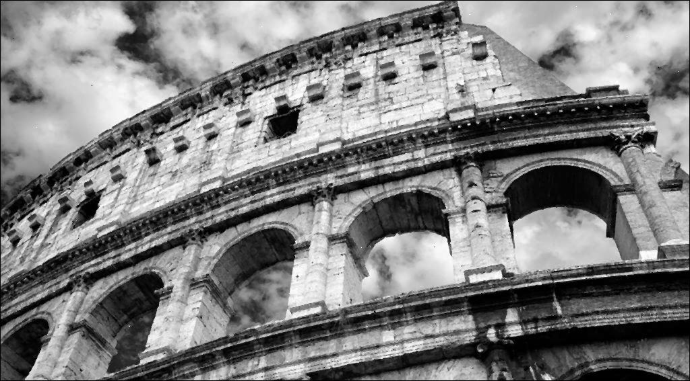

# HW6 results
### input:  
  

### Histogram Equalization result:  
  

### Local Histogram Equalization result:  
  

### input:  
  

### Adding Salt and Peper noise    
  

### Fixing salt and pepper with Median Filter  
  

### Fixing salt and pepper with Gaussian Filter  

